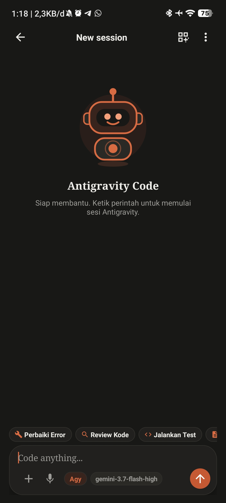
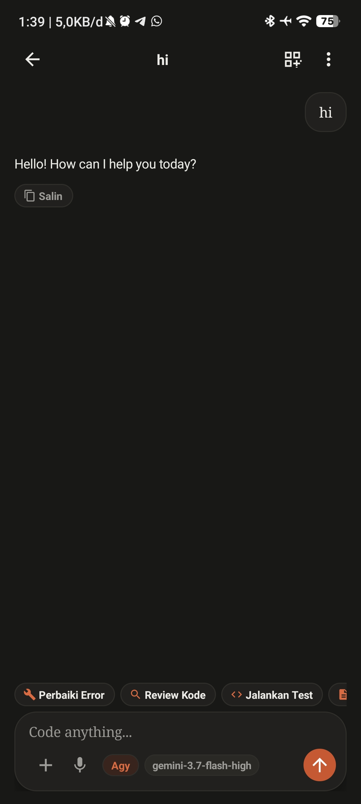
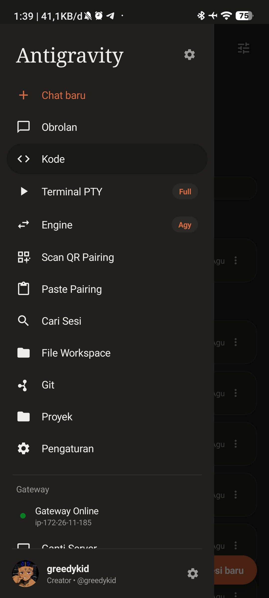
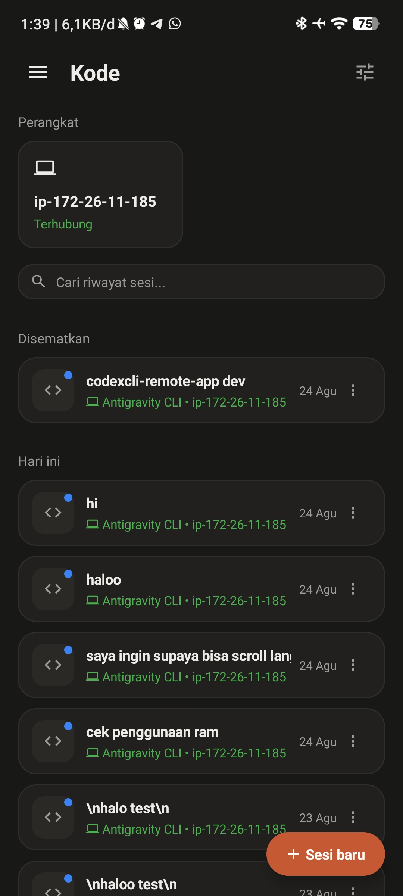

# 🌌 Antigravity & Codex Remote for Android

> **Mobile Command Center & Live Companion HUD for Google Antigravity CLI (`agy`) and OpenAI Codex CLI.**

Antigravity Remote adalah aplikasi Android native yang memungkinkan Anda mengontrol, memantau, dan berinteraksi secara real-time dengan **Google Antigravity CLI** maupun **OpenAI Codex CLI** yang berjalan di VPS, server, atau komputer lokal Anda langsung dari genggaman tangan.

---

### 📦 Unduhan Cepat (Latest Release)

* 🤖 **Android APK:** [Download app-debug.apk](https://github.com/greedykid/antigravity-cli-app/releases/download/latest/app-debug.apk)
* 🍏 **iOS IPA:** [Download CodexRemote.ipa](https://github.com/greedykid/antigravity-cli-app/releases/download/latest/CodexRemote.ipa)
* 🏷️ **Halaman Rilis GitHub:** [Release latest](https://github.com/greedykid/antigravity-cli-app/releases/tag/latest)

---

## 📸 Tangkapan Layar Aplikasi

| Sesi Baru (Empty State) | Percakapan Real-Time | Menu Navigasi Sidebar | Code Hub (Semua Sesi) |
| :---: | :---: | :---: | :---: |
|  |  |  |  |

---

## 📱 Fitur Unggulan

* **⚡ Pembaruan Otomatis In-App:** Periksa rilis terbaru dan pasang file APK langsung dari dalam aplikasi tanpa perlu membuka browser manual.
* **👆 Gesture Swipe Bottom Sheet:** Geser ke atas (*swipe up*) untuk membuka modal dalam tampilan penuh (*fullscreen*), geser ke bawah (*swipe down*) untuk menutup modal seketika.
* **🎨 Claude Code & Material Design Aesthetics:** Tampilan warm-ivory (`#FBFBF9`), aksen terracotta orange (`#D96B43`), tipografi serif elegan, dan dark code blocks.
* **⚡ Instant In-Session Live Streaming:** Transkrip percakapan, proses pemikiran (*Thinking*), dan eksekusi perintah (*Tool Calls*) ter-update secara real-time detik demi detik di layar tanpa perlu keluar-masuk sesi.
* **🛡️ Sliding Inactivity Timeout:** Mencegah proses AI multi-langkah terputus di tengah jalan saat melakukan eksekusi task panjang.
* **🖼️ Multi-Image & Zoom Preview:** Unggah banyak gambar sekaligus dengan pratinjau resolusi penuh sebelum dan sesudah dikirim ke AI.
* **💻 Interactive Quick Terminal (PTY):** Jalankan perintah shell cepat dengan penyesuaian keyboard otomatis dan live task badge.
* **📷 Instant QR Code Pairing:** Cukup scan QR code di terminal PC/VPS Anda dengan kamera HP untuk terhubung secara instan tanpa perlu mengetik URL panjang.
* **🖼️ Pairing dari Galeri:** Punya screenshot QR dari sesi SSH atau foto lama? Pilih gambarnya langsung — tidak perlu kamera menyorot terminal.
* **📋 1-Tap Clipboard Pairing:** Salin tautan pairing (`agy://connect?...`) atau JSON token di HP, lalu ketuk *Paste from Clipboard*.
* **🔄 Two-Way Live Terminal Synchronization:** Pantau sesi terminal PC yang sedang berjalan secara langsung di HP (*Live Companion HUD*), atau lanjutkan instruksi dari HP secara bergantian.
* **🔀 Dual Engine Gateway:** Beralih antara engine **Google Antigravity CLI** dan **OpenAI Codex CLI** dengan 1 ketukan.
* **🗂️ Riwayat per Engine:** Daftar sesi, "Terbaru" di sidebar, dan pencarian hanya menampilkan sesi milik engine yang sedang aktif.
* **🎨 Tema per Engine:** Seluruh tampilan berganti mengikuti engine aktif — Antigravity (terracotta warm) dan Codex (slate teal).
* **📊 Rich Markdown & Native Tables:** Format Markdown lengkap dengan tabel horizontal scrollable dan tombol salin kode cepat.
* **🎙️ Voice Dictation (STT):** Input suara praktis untuk mendiktekan prompt coding panjang.
* **🔔 Notifikasi Task Selesai:** Kirim prompt panjang, kunci layar — HP memberi tahu saat task selesai atau gagal lewat koneksi SSE latar belakang.
* **📁 File Browser Workspace:** Telusuri dan baca file di workdir server langsung dari HP, lengkap dengan syntax highlight.
* **🔀 Panel Git:** Lihat branch, file berubah, diff berwarna, lalu commit dan push tanpa membuka terminal.
* **🔎 Pencarian Sesi:** Cari kata kunci di judul maupun isi transkrip semua sesi.
* **🖥️ Multi-Server Profile:** Simpan beberapa server/VPS dan beralih profil dengan satu ketukan.

---

## 🔐 Keamanan

Bridge server menjalankan perintah CLI sebagai user Anda, jadi aksesnya diperlakukan sebagai kredensial penuh ke server:

* **Token unik per instalasi.** Dibuat otomatis saat server pertama kali jalan dan disimpan di `~/.codex-remote/token` (mode `0600`).
* **Hanya loopback.** Server bind ke `127.0.0.1` secara bawaan; satu-satunya pintu masuk adalah Cloudflare Tunnel terenkripsi.
* **Ganti token kapan saja:** `codex-remote rotate` — server direstart dan QR pairing baru ditampilkan.
* **Batasi kemampuan CLI** lewat menu *Mode Eksekusi* di aplikasi (`full` / `workspace` / `readonly`).

---

## ⚡ Setup Server 1-Perintah (Paling Cepat & Otomatis)

Jalankan perintah berikut di terminal VPS / server Linux Anda:

```bash
curl -fsSL https://raw.githubusercontent.com/greedykid/antigravity-cli-app/main/install.sh | bash
```

Script ini akan secara otomatis:
1. Menginstall Node.js dan Cloudflared (jika belum ada).
2. Menyiapkan service server background (`codex-bridge` & `codex-tunnel`) agar selalu aktif otomatis saat booting/restart.
3. Menghubungkan Cloudflare Tunnel publik secara gratis dan aman.
4. Menampilkan **QR Code Pairing** di terminal untuk langsung di-scan dari HP Android Anda!

### 🛠️ Perintah Bantuan Terminal (Setelah Install)
Ketik perintah ini di terminal Anda kapan saja:
* `codex-remote` atau `agy-remote` : Menampilkan kembali QR Code Pairing & URL.
* `codex-remote status` : Memeriksa status aktif server & tunnel.
* `codex-remote logs` : Membuka live monitor logs server.
* `codex-remote restart` : Merestart server bridge dan tunnel.
* `codex-remote rotate` : Membuat token baru (perlu pairing ulang dari HP).

---

## 🚀 Panduan Setup Manual (Alternatif)

Jika Anda ingin menjalankan secara manual tanpa background service:

```bash
# 1. Jalankan server bridge
cd bridge
npm install
node server.js

# 2. Buka tunnel di terminal terpisah
cloudflared tunnel --url http://127.0.0.1:8787
```

---

## 📱 Memasang & Menghubungkan Aplikasi Android

1. **Unduh APK:**
   * Unduh langsung dari [Halaman Rilis GitHub](https://github.com/greedykid/antigravity-cli-app/releases/tag/latest) -> `app-debug.apk`.
   * Instal di HP Android Anda.

2. **Hubungkan Aplikasi (Pilih salah satu metode):**
   * **Scan QR Code (Paling Cepat & Direkomendasikan) 📸:** Buka aplikasi -> ketuk tombol QR di pojok kanan atas -> arahkan ke layar terminal.
   * **1-Tap Clipboard Pairing 📋:** Salin link pairing terminal (`agy://connect?...`) -> buka sidebar -> ketuk *"Paste Pairing from Clipboard"*.
   * **Pengaturan Manual ⚙️:** Buka sidebar -> *"Connection Settings"* -> Masukkan Bridge URL & Token.

---

## 🌐 API Bridge

Semua endpoint (kecuali `/health`) butuh header `Authorization: Bearer <token>`.

| Method | Endpoint | Kegunaan |
|---|---|---|
| GET | `/health` | Status server, daftar engine dan fitur |
| GET | `/api/events` | Stream Server-Sent Events (`task.started`, `cli.event`, `task.finished`) |
| POST | `/api/chat` | Kirim prompt; `conversationId` melanjutkan sesi lama |
| GET | `/api/sessions` | Daftar sesi; `?engine=` menyaring per CLI |
| GET | `/api/session/transcript?id=` | Transkrip satu sesi |
| GET | `/api/search?q=` | Cari di judul dan isi transkrip |
| GET | `/api/files?path=` | Daftar isi folder (dikunci di dalam workdir) |
| GET | `/api/files/read?path=` | Baca file (deteksi biner & batas ukuran) |
| GET | `/api/git/status`, `/api/git/diff` | Status dan diff repo |
| POST | `/api/git/commit`, `/api/git/push` | Commit dan push |
| GET/POST | `/api/settings` | Mode sandbox dan preferensi notifikasi |
| POST | `/api/session/control` | Interrupt task yang sedang jalan |
| POST | `/api/upload` | Upload file / gambar |
| POST | `/api/files/write` | Tulis file (dikunci di workdir) |
| GET | `/api/jobs`, `/api/jobs/:id` | Status task yang berjalan di latar |
| GET | `/api/session/export?id=` | Transkrip sesi dalam Markdown |
| GET/POST | `/api/projects` | Daftar folder proyek |
| GET | `/api/audit` | Catatan aktivitas |

---

## 🍏 Versi iOS (.ipa)

Klien iOS native (SwiftUI) tersedia di folder `ios/`.

### Mengunduh
Setiap push ke `main` menghasilkan build **CodexRemote.ipa** di GitHub Releases `latest`.

---

## 👤 Kredit & Pembuat

* **Lead Developer & Creator:** [@greedykid](https://github.com/greedykid)
* **Repository:** [greedykid/antigravity-cli-app](https://github.com/greedykid/antigravity-cli-app)
* **Lisensi:** Open Source & Bebas Digunakan.

